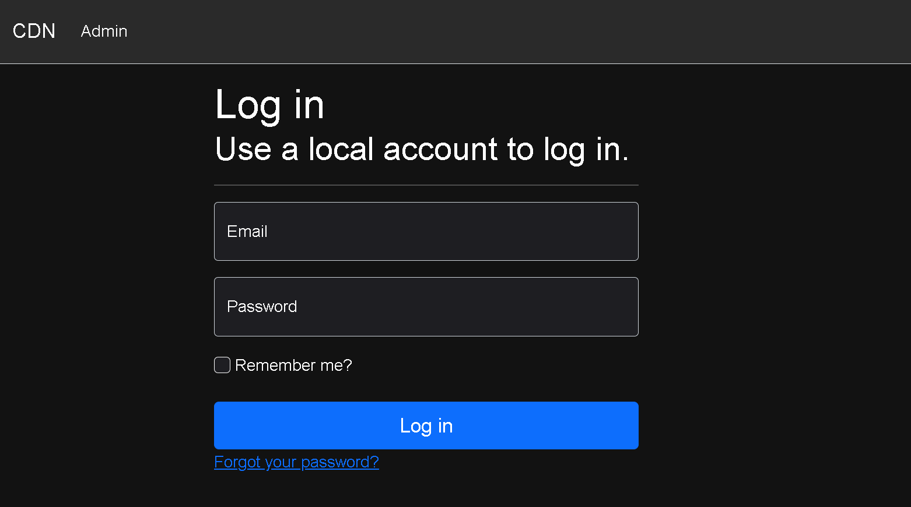
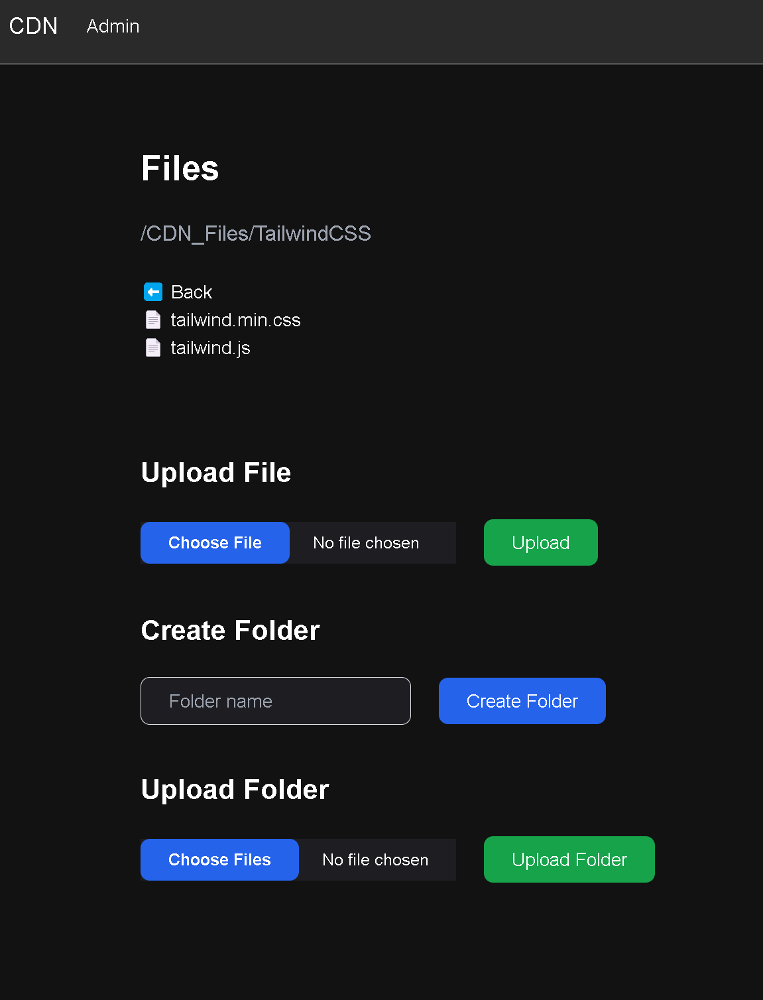
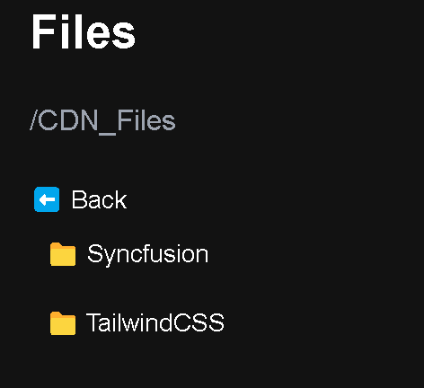

# Content Delivery Network

## Table of Contents
- [Content Delivery Network](#content-delivery-network)
  - [Table of Contents](#table-of-contents)
  - [Introduction](#introduction)
  - [User Functionality](#user-functionality)
    - [Admin Portal Login](#admin-portal-login)
    - [Admin Portal](#admin-portal)
  - [Conclusion](#conclusion)

## Introduction
A Content Delivery Network (CDN) is a system of distributed servers that deliver web pages and other Web content to a user based on the geographic locations of the user, the origin of the webpage and a content delivery server. This service is effective in speeding the delivery of content of websites with high traffic and websites that have global reach. The closer the CDN server is to the user geographically, the faster the content will be delivered to the user. CDNs also provide protection from large surges in traffic.

This is not a Distributed System. 

A 1 server CDN is a basic content delivery network setup that uses a single server strategically located to cache and efficiently deliver content to users in its proximity.

## User Functionality
The CDN has an Admin Portal that allows users to login and upload files to the server. The login is handled using Micorsoft Identity Framework where the data is stored in a Microsoft SQL Server database. The files are uploaded to a FTP server that is then used when the file needs to be retrieved. This allows the CDN data to be stored on a different server than the web server to allow for higher reliability and increased redundency.

### Admin Portal Login

    

### Admin Portal

    

 

Here Administrators can create new folders and upload new files by clicking through to the folder location they want the file to be uploaded to.

    

## Conclusion
This CDN is a basic setup that allows for the uploading of files to a server that can then be retrieved by users. This is a basic setup that can be expanded upon to include more features and functionality. Currently some of the uploaded files include [Tailwind CSS files](https://cdn.romitsagu.com/CDN/TailwindCSS/tailwind.min.css) that can be used in web development projects and a [Custom Compiled OpenCV](https://cdn.romitsagu.com/Files/Python/OpenCV/CustomBuildPy3.9OpenCV4.10.0-OpenCL-GL.zip) python library with OpenCL and OpenGL support that can be used in computer vision.